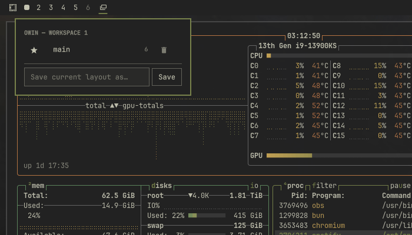

```text
 ██████╗ ██╗    ██╗██╗███╗   ██╗
██╔═══██╗██║    ██║██║████╗  ██║
██║   ██║██║ █╗ ██║██║██╔██╗ ██║
██║   ██║██║███╗██║██║██║╚██╗██║
╚██████╔╝╚███╔███╔╝██║██║ ╚████║
 ╚═════╝  ╚══╝╚══╝ ╚═╝╚═╝  ╚═══╝
```

Per-workspace window layout presets for [Omarchy](https://omarchy.org/) (Hyprland).



Lay out a workspace the way you like it — six terminals and a browser in
just the right splits, or a couple of floating windows over the wallpaper —
and save it as a preset. From then on, one click on the bar brings it back:

- **Left click** the bar icon: restore the focused workspace's favorite preset.
- **Right click**: open the flyout to restore, save, favorite, or delete presets.

Restore is also **repair**: windows that already exist are kept and snapped
back to their saved size and position, missing ones are relaunched (with
their working directory and running command, when detectable), and windows
that aren't part of the preset are closed. Tiled and floating layouts both
work — tiled layouts are rebuilt as a dwindle split tree and pixel-corrected,
floating windows come back at their exact geometry.

Each workspace has its own presets; they are never shared between workspaces.

## Install

```bash
omarchy plugin add https://github.com/johnafarmer/owin
omarchy plugin enable owin --section left
```

(Or clone the repo and symlink it: `ln -s /path/to/owin ~/.config/omarchy/plugins/owin`,
then `omarchy-shell shell rescanPlugins` and enable as above.)

Requires an Omarchy build with the Lua-configured Hyprland (`hyprctl eval` /
`hl.dsp.*` — present on current Omarchy). Python 3 ships with Omarchy.

## CLI

Everything the widget does is also available from the terminal:

```bash
owin() { ~/.config/omarchy/plugins/owin/bin/owin "$@"; }

owin capture dev            # save the current workspace layout as "dev"
owin restore                # restore the favorite preset (repairs in place)
owin restore dev --dry-run  # show what a restore would do, touch nothing
owin list                   # list presets for the focused workspace
owin favorite dev           # left click on the bar now runs "dev"
owin delete dev
```

Presets are plain JSON in `~/.local/share/owin/presets.json` — edit the
launch commands there if the auto-detected ones need tweaking.

## Keybind

Give the favorite preset a key, so the focused workspace snaps back without
reaching for the bar:

```bash
owin bind "SUPER + CTRL + L"   # set (or change) the keybind
owin bind                      # show the current keybind
owin bind --remove             # remove it
```

The bind lands as one marked line in `~/.config/hypr/bindings.lua`, is
validated with `hyprctl configerrors`, and is reverted automatically if
Hyprland objects. Like the bar icon, it always acts on the workspace you're
on: same key, different workspace, different layout.

## How restore works

1. Windows on the workspace are matched to preset slots by identity, in
   order of certainty: the owin tag stamped on each window at capture
   time (tags stick for a window's lifetime), then the marker app-id
   owin launches terminals with, then what is actually *running inside*
   the window (live `/proc` foreground process + working directory) —
   titles and geometry only break ties. A slot that wants a program never
   adopts a window running something else: the impostor is closed and the
   real thing relaunched.
2. Unmatched windows are closed; matched ones keep running.
3. Missing windows spawn floating at their saved position (floats don't
   perturb the tiling tree, so spawn order doesn't matter).
4. If the tiled windows aren't already sitting in their saved arrangement,
   the tree is rebuilt in place: every tiled preset window is floated
   (lifted out of the tree without being killed), then re-tiled one by one
   in split order — computed from the saved geometry as a guillotine
   tree — using dwindle `preselect`. This reproduces the exact topology
   with zero relaunches.
5. A final pass applies exact resizes until everything is within a few
   pixels of the saved layout. When nothing is out of place, steps 3–5
   reduce to a no-op.

Keep your hands off the mouse for the couple of seconds a restore with
relaunches takes — spawned windows land wherever focus is.

## Notes

- Launch-command detection reads `/proc`: for terminals (foot, alacritty,
  kitty, ghostty) it records the foreground program and its working
  directory; other apps are relaunched with their full command line.
  Chromium webapp windows (`chrome-<domain>__-<profile>` classes) are
  relaunched through `omarchy-launch-webapp`.
- A window you can't relaunch (no command captured) is reported and skipped.
- All window manipulation goes through Omarchy's Lua Hyprland API
  (`hl.dsp.*` via `hyprctl eval`); reads use plain `hyprctl -j`.
- Tested on Omarchy with the dwindle layout.
